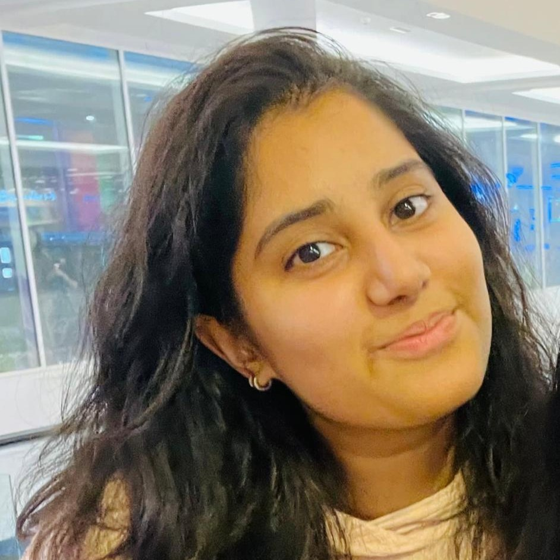

**Shortcut menu**: [Supported Courses](#supported-courses)---[Schedule](#schedule)

# What is InfBase?

InfBase is a drop-in helpdesk for first and second year students to get lab support and additional support for their courses. 

Each session is supported by Informatics students in higher years, who can give 1-on-1 support and advice to help you work through problems with lab exercises that you are encountering on your core pre-honours Informatics courses. 

In addition to supporting drop-in assistance, InfBase can be used as a place to work together with other students, with support from an InfBase demonstrator. Sessions will run in Appleton Tower 7.03 (7th floor). 

<!-- If you have suggestions and feedback for InfBase, please [let us know how we are doing](feedback.html). -->

## InfBase helps you with the following courses 

__Semester 1:__
* Year 1: Informatics 1 - Introduction to Computation
* Year 2: Informatics 2 - Foundations of Data Science
* Year 2: Informatics 2 – Introduction to Algorithms and Data Structures
* Year 2: Informatics 2C - Introduction to Computer systems

__Semester 2:__
* Year 1: Informatics 1 - Object Oriented Programming
* Year 2: Informatics 2 - Software Engineering and Professional Practice
* Year 2: Informatics 2D - Reasoning and Agents
* Year 2: Informatice 2 - Foundations of Data Science
* Year 2: Informatics 2 - Introduction to Algorithms and Data Structures

## Schedule

Regular InfBase sessions start in Week 2 of the semester and will run until the end of revision week.

|Day | Time |
|----|---------|
| Monday | 11:10-13:00 |
| Tuesday | 11:10-13:00 |
| Wednesday | 11:10-13:00 |
| Thursday |  11:10-13:00 |

## Demonstrator

| | |
| :---: | :---: |
|    **Kashvi** |    **Vaishnavi** |
|    **Jakub** |    **Fola** |
|    **Shreeya** |    **Will** |
|    **Vasu** |    **Aarush** |
